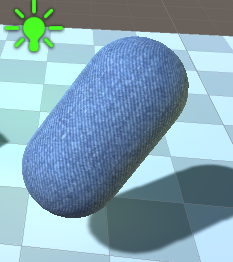
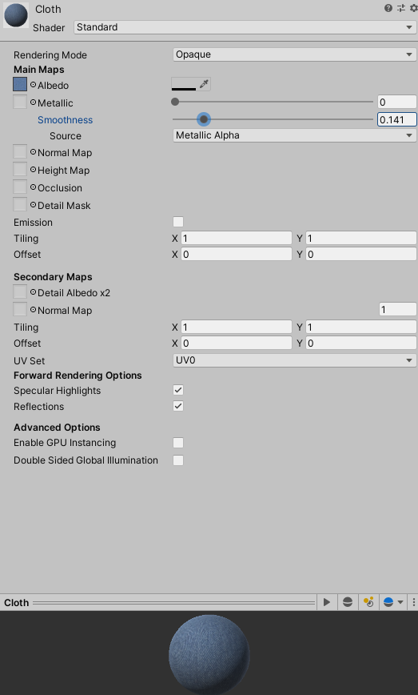
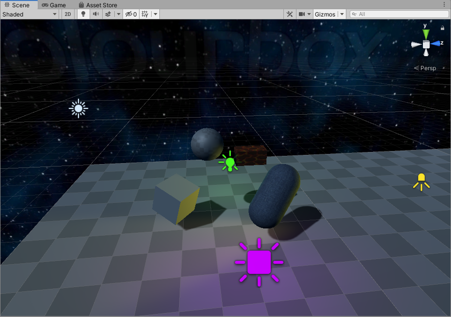
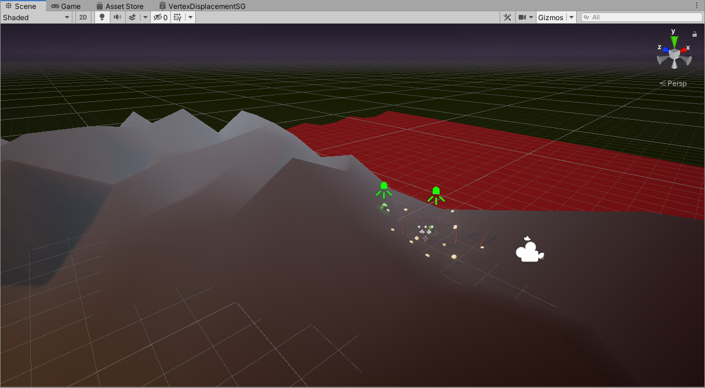
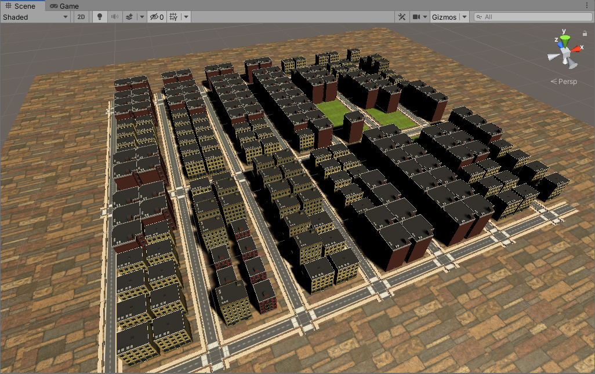
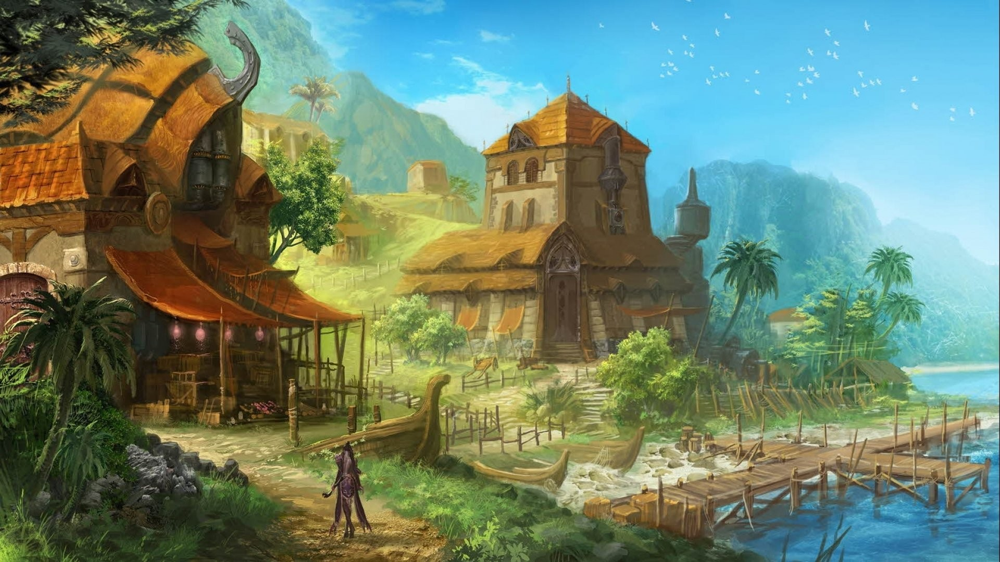
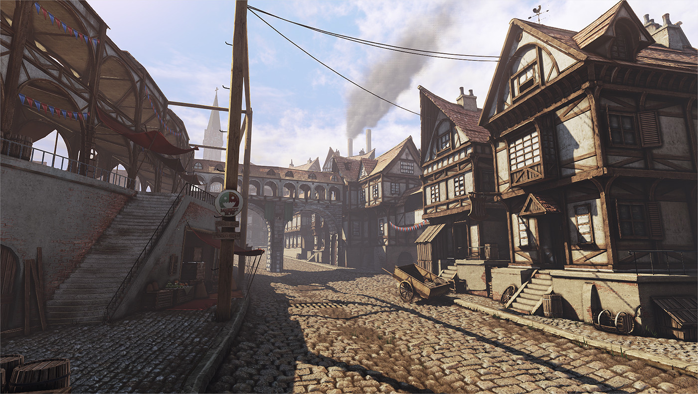
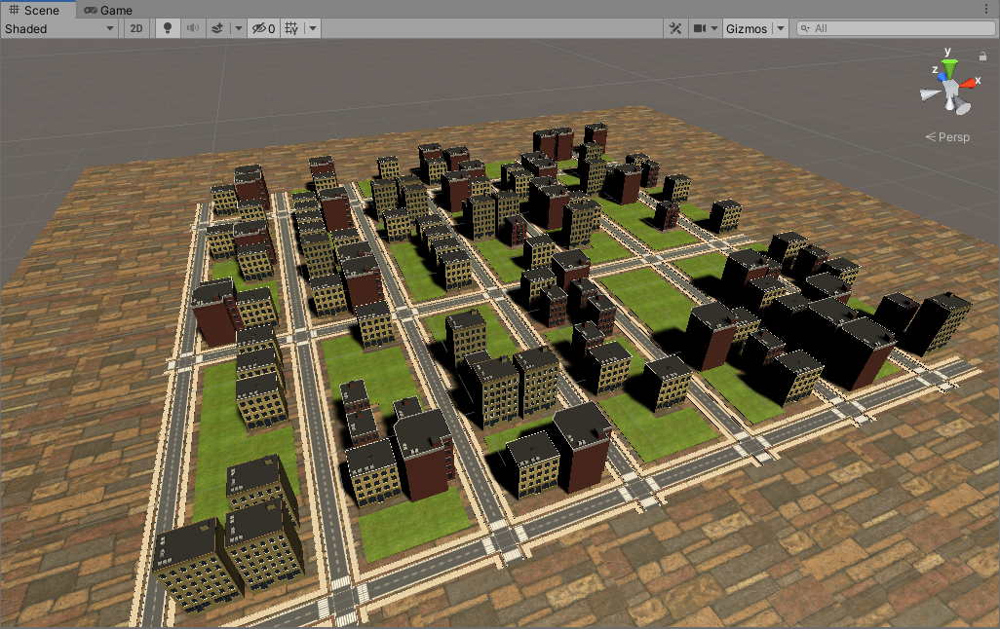

# CMPM163Labs
lab 2: https://drive.google.com/open?id=1_TnqecQWUwk1OoCeVVfCuX8CIy_TbgWd

lab 3: https://drive.google.com/file/d/1Pwv4xZxxUiEZv_Sw24143XEYQn1M42gX/view?usp=sharing

Cube 1 (Crimson): This cube was made with Three.js materials. I changed the color of this cube to crimson, and added a red specular value, along with increased shine.
Cube 2 (Turquoise and Red): This cube was built with my shaders, and I chose the colors turquoise and red for its interpolation.
Cube 3 (Default): This cube was made with Three.js materials. This cube was not changed from how it started (as intended by the lab instructions.)
Cube 4 (Blue and Green): This cube was built with my shaders, and I chose the colors blue and green for its interpolation.

lab 4:
https://drive.google.com/file/d/1PeRZodNdlyG-TQyRmuG3aizkzOYaMy4u/view?usp=sharing

24a. The formula would be x = ⌊u * 7⌋.
24b. The formula would be y = ⌊7 - (v * 7)⌋
24c. x = ⌊0.375 * 7⌋ = 2, y = ⌊7 - (0.25 * 7)⌋ = ⌊7 - 1.75⌋ = 5
   thusly, we sample the coordinate at (2,5), which is the color gray.
   
Cube 1: I used textures and normal maps from the lab's included drive folder for every cube. For cube 1, I used 156.jpg, and built it with the three.js built in texture functionality. This cube went on the left.
Cube 2: This cube was the same as the first, but I also used 156_norm.jpg as a normal map, matching the texture. This cube went in the middle, and used the three.js built in texture functionality.
Cube 3: For this cube, I used the three.js built in texture functionality, but I also used 151.jpg as a texture, and 152_norm.jpg as a normal map. This cube went above the others. (This cube is also labeled as cube4 in my code.)
Cube 4: For this cube, I loaded the texture 157.jpg with the supplied shaders, and moved the cube to the right. (This cube is also labeled as cube3 in my code.)
Cube 5: For this cube, I used texture 179.jpg, and tiled it in a 2x2 grid. My new shaders were created in seperate shader files, then loaded into lab4.html through code, as the others were. In vertexShader2.vert, I simply wrote "vUv = uv * 2.0;" instead of the default definition. Then, in fragmentShader2.frag, I changed the texture2D code to call "mod(vUv, 1.0)" instead of just "vUv" inside of the function arguments.

lab 5:
I chose to do Part 1.
https://drive.google.com/file/d/16V5L9PsxAN-NeHJlxtvc5_7gVdHPbLaJ/view?usp=sharing
For my modifications, I made the car particles red, and made them come from the exhaust, instead of the tire. In addition, I made a rainbow material for the main character, and I replaced the ground and skybox with images on my computer. I also tiled the ground texture to get the full glory of the image.

lab 6:
I chose to do Part 1.
Spotlight: A light that shines in a cone, with direction, angle, and position.
Directional Light: A scene-wide light source that has no position, but does have a rotation value.
Point Light: The simplest light. Has exclusively position. Effectively a light bulb.
Area Light: A baking-exclusive light that shines on one side of a 2D plane in space. Has position and rotation.

I made this material with an Albedo image of blue cloth, and by turning the smoothness value down to 0.141.

For my textures, I found two images, and put them both in the Assets folder. One was a pixelated texture of stone, the other of lava.

The skybox I added is a 6-sided cube composed of a .jpg of some stars, repeated on all sides.

lab 7:
https://drive.google.com/file/d/1yxONh1zrK4bWiLFTsTSuAOrecuGBK5b2/view?usp=sharing
For this scene, I zoomed in on a beach-side section of my mountain range, with the water nearby. (Rest assured, the mountain range is present. The attached image below shows the entirety of the scene.) I used pre-made tree models with a red, oily texture, as well as numerous spheres with my own texture, and 2 green cylinders with a green material. A cubic particle system lies beneath the terrain, constantly letting blue orbs fly up into the air above. The water is a bright red, and waves tumultuously. I also added a procedural skybox, which depicted a dark, desolate sky. 2 spotlights shine above each cylinder, and the cylinders do not cast shadows, to make it appear as though they are radiating this light themselves.

lab 8:
Tutorial City:

(The original city had an asphalt texture, but I changed it for my custom city.)

City Inspiration Pictures:

Custom City:

In inspiration from my discovered city sources, I decided to try and make some changes to give the city a more rural/fantasy look. Firstly, I changed the asphault texture to a brown stone, then I changed the code to generate a lot more grass. I put this in the middle of the value range, so it would mix in with the buildings. Secondly, I modified the horizontal road frequency to be lower, so there are less roads in the city render. Finally, I modified the Perlin Noise coordinates to accomodate for a seed value, and "zoomed out" of the noise, to generate more random building groupings. This was done by dividing the width and height coordinates by a lower number, reducing it from 10.0f to 3.0f.
